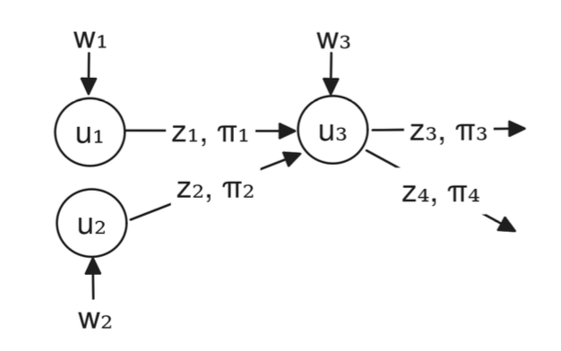
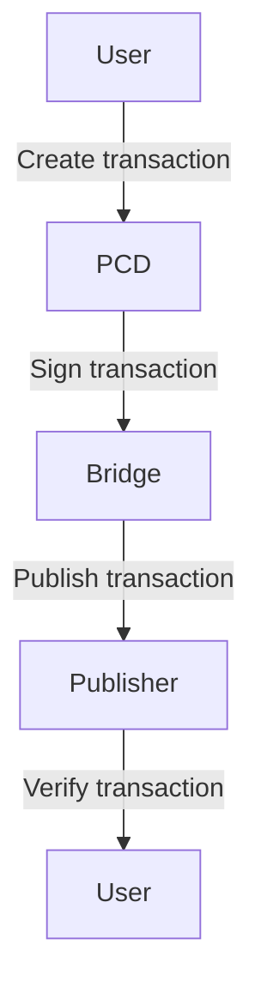
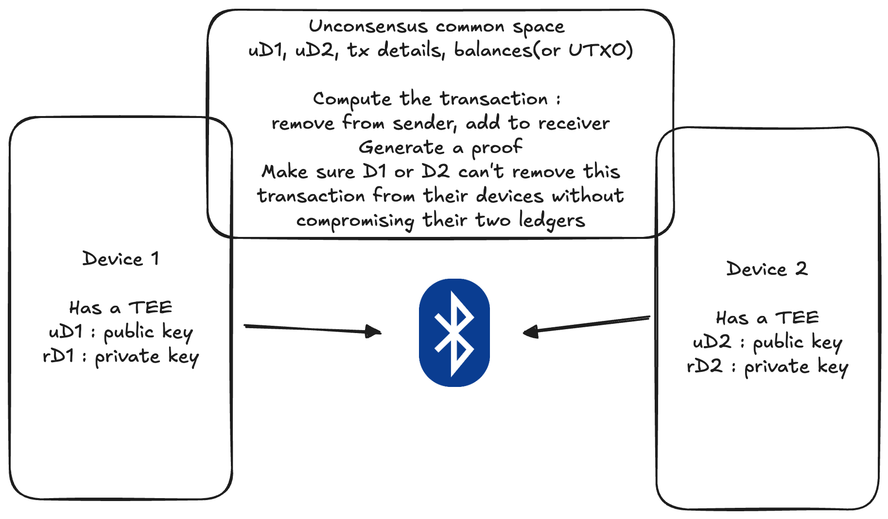

# SoloSafe : Offline tamper-resistant payment system 
## Presented by El : el [ at ] solosafe [ dot ] xyz
## Date: 2025-04-15
## Version: 0.1

\newpage  

## Table of Contents
- [Abstract](#abstract)
- [Introduction](#introduction)
- [Problem Statement](#problem-statement)
- [Proposed Solution](#proposed-solution)
  - [Bridge](#1-bridge)
  - [PCD](#2-pcd)
  - [Publisher](#3-publisher)
- [System architecture](#system-architecture)
- [Implementation](#implementation)
- [Conclusion](#conclusion)
- [References](#references)
- [Appendix](#appendix)
- [Acknowledgements](#acknowledgements)
- [License](#license)
- [Contributing](#contributing)
- [Contact](#contact)
- [About](#about)
- [Changelog](#changelog)

\newpage  

## Abstract 

\newpage
## Introduction 
Payment systems are a critical part of modern commerce, enabling the transfer of value between parties. However, many existing payment systems are now fully decentralized and rely on a consensus mechanism to validate transactions. These consensus mechanisms relay on a state machine that is replicated across all nodes in the network. While this is truly revolutionary, many people that do not have reliable internet access are unable to use these systems. Most of developed countries have good centralized financial infrastructure and internet access, but many developing countries do not. This paper proposes a new payment system that is offline and tamper-resistant, allowing users to make transactions without the need for a centralized authority or internet access. The system is based on a combination of cryptographic techniques and hardware security modules to ensure the integrity and authenticity of transactions. The proposed system is designed to be easy to use and accessible to anyone, regardless of their technical expertise or access to technology.  

## Problem Statement
Currently, digital payments rely uppon access to the Internet. Consensus mechanisms allow permissionless transactions to be verified and recorded on a distributed ledger. However, it is currently difficult to let users to make transactions using edge devices that are connected through ad hoc networks like Bluetooth or Wi-Fi Direct. This is due to the fact that each device having its own state machine, could be out of sync with the rest of the network and some malicious user could modify their state to steal funds.  
  
This paper proposes a new payment system that is offline and tamper-resistant, allowing users to make transactions without the need for a centralized authority or internet access. The system is based on a combination of cryptographic techniques and hardware security modules to ensure the integrity and authenticity of transactions. The proposed system is designed to be easy to use and accessible to anyone, regardless of their technical expertise or access to technology.

## Proposed Solution
### 1. Bridge 
### 2. PCD 

### 3. Publisher
### 4. 

## System architecture 

Here is a diagram of the system architecture:

> [!NOTE]
> Useful information that users should know, even when skimming content.

> [!TIP]
> Helpful advice for doing things better or more easily.

> [!IMPORTANT]
> Key information users need to know to achieve their goal[^2].

> [!WARNING]
> Urgent info that needs immediate user attention to avoid problems.

> [!CAUTION]
> Advises about risks or negative outcomes of certain actions.

## Implementation

## Conclusion

\newpage